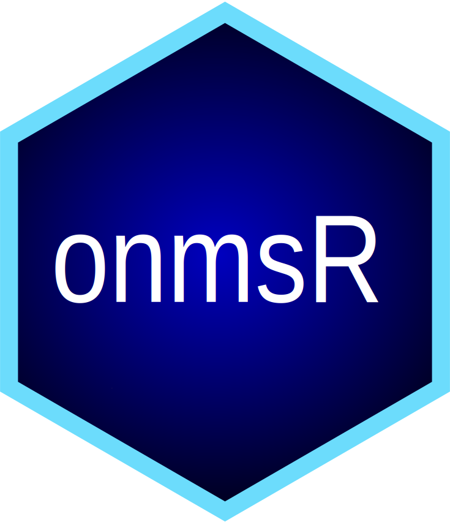

# onmsR 

**onmsR** is an R package of common functions for dataset wrangling and plotting used across National Marine Sanctuaries, originally for interactive infographic products per Sanctuary (see [infographiq](https://marinebon.org/infographiq)).

## Installation

```r
# Install from Github
devtools::install_github("noaa-onms/onmsR")
library(onmsR)
```

## Getting started

If you're getting started with `onmsR`, please take a look at the **Reference** and **Articles** menus and especially [Get started](articles/onmsR.html) article.


